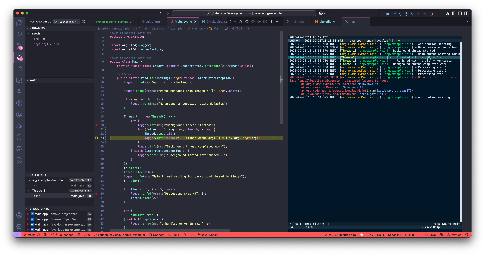

# lnav-debug-example

This repository can be used to demonstrate the
"Log-Oriented Debugging" features in lnav.  These
features streamline the mapping of log messages
back to the source code that generated those
messages.  For example, given the message
"opening file: /a/b/input.json", the
corresponding log statement in the source code
(`log.info("opening file: %s", path)`) can be
found and the values of the arguments determined
(`path` => `/a/b/input.json`).  This mapping can
be shown directly in lnav by opening the message
details overlay (press `p`).  Taking it even
further, the lnav VS Code extension has been
modified to contribute a debugger mode that can
communicate with an lnav instance.

## Components

The "Log-Oriented Debugging" feature is a combination
of the following components:

* [log2src](https://github.com/ttiimm/log2src) - A
  library that discovers log statements in source
  code and can match them to a log message.
* [lnav](https://lnav.org) - The Logfile Navigator,
  a log file viewer for the terminal that handles
  the log file processing and integrates with log2src.
* [lnav-vscode](https://github.com/tstack/lnav-vscode/) -
  The lnav VS Code extension that contributes a debugger
  for the language supported by log2src.

## Screenshots

The following screenshot shows an example session of
"Log-Oriented Debugging":

The VSCode window is made up of the following:

* The editor tab on the right contains an instance
  of lnav with the log file that was generated.
  The highlighted line ("Finished with: ...") is the
  currently focused log message.
* In the middle is the [Java code](java-logging-example/src/main/java/org/example/Main.java)
  being debugged.  The highlighted line is the log
  statement that generated the log messages that is
  focused in the lnav tab.
* The "Variables" panel in the top-left contains the
  expressions and their values that were used as
  substitutions in the log statement.
* The "Call Stack" panel on the left shows the last
  location of the known threads in the log file at
  the focused time.  Since the focused log message
  is in-between the lifetime of the two threads, they
  are both shown.  Changing the focused log message
  to one that is before or after "Thread-1" will
  change this panel to only show the main thread.
* The "Breakpoints" panel shows breakpoints that
  are set on log statements in the code.
* The top-right button bar are the debugger controls.
  Pressing the "Continue" button will move the
  focused log message to the next breakpoint for
  the current thread.  Pressing "Step Over" will move
  to the next log message in the current thread.
  Pressing "Step Back" will move to the previous log
  message in the current thread.  Movements in lnav
  itself will also be reflected in the source code
  editor and debug panels.

This screenshot shows lnav embedded into VS Code,
but you can also run lnav in a terminal and connect
to it from VS Code.
